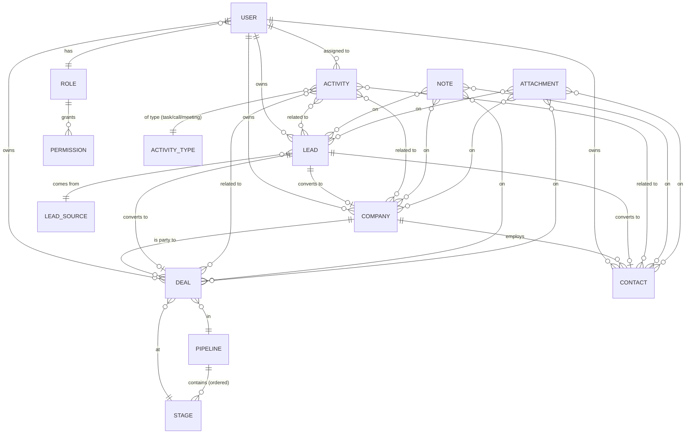

# Entity Relationship Diagram

Source of truth for the data model. Update this in the same PR that changes
the schema.

## Entities — fields (initial pass)

### User
- id (PK), email (unique), password_hash, first_name, last_name, role_fk
- is_active, last_login, created_at, updated_at

### Role
- id, name (Admin, Manager, Sales Rep), description

### Company (Account)
- id, name, industry, website, phone, billing_address, shipping_address
- annual_revenue, employee_count, owner_fk → User
- is_deleted, created_at, updated_at, created_by_fk

### Contact
- id, first_name, last_name, email, phone, title, company_fk → Company
- owner_fk → User, is_deleted, created_at, updated_at, created_by_fk

### Lead
- id, first_name, last_name, email, phone, company_name (raw text)
- source_fk → LeadSource, status (new/contacted/qualified/lost/converted)
- owner_fk → User, converted_at, converted_deal_fk → Deal
- is_deleted, created_at, updated_at, created_by_fk

### Deal
- id, name, amount, currency, close_date, pipeline_fk, stage_fk
- company_fk → Company, primary_contact_fk → Contact
- owner_fk → User, probability (0–100), won/lost flags
- is_deleted, created_at, updated_at, created_by_fk

### Pipeline + Stage
- Pipeline: id, name, is_default
- Stage: id, pipeline_fk, name, order_index, probability, is_won, is_lost

### Activity
- id, type (task/call/meeting), subject, description
- due_at, completed_at, assigned_to_fk → User
- generic relation: (content_type, object_id) — Django ContentTypes
- created_at, updated_at, created_by_fk

### Note + Attachment
- Same generic-relation pattern as Activity.

> Convention: every business entity has `is_deleted`, `created_at`,
> `updated_at`, `created_by` — provided by `apps.core.TimestampedModel`.
